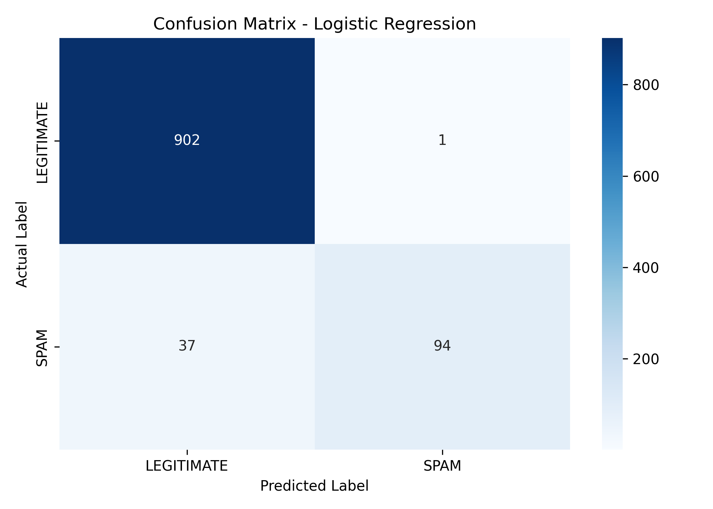
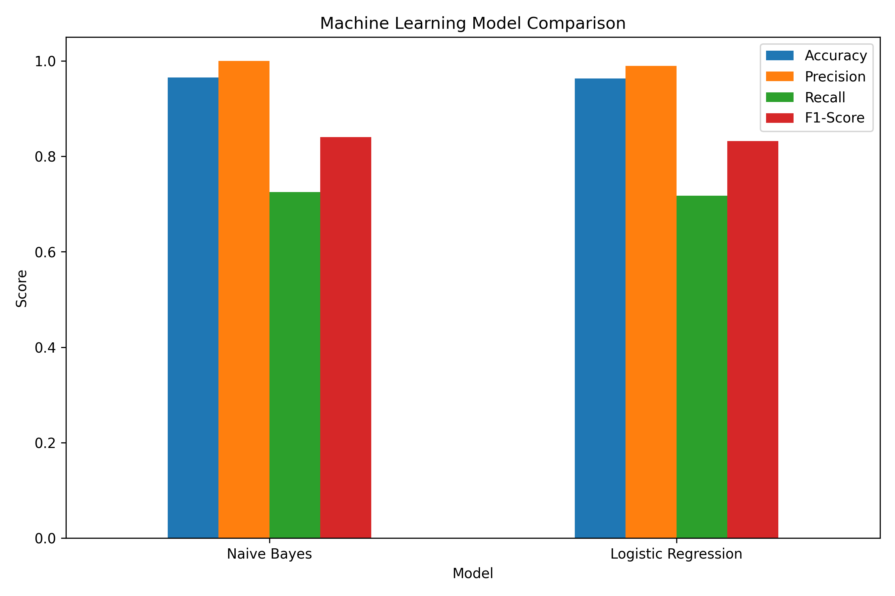

# AI-Powered SMS Spam & Scam Detector

A machine learning and Natural Language Processing (NLP) project that classifies SMS messages as **LEGITIMATE** or **SPAM / SCAM**.

## Project Overview

This project demonstrates how NLP and Machine Learning can be used to detect suspicious SMS messages. Two classical machine learning models are trained and compared using TF-IDF text features:

- Multinomial Naive Bayes
- Logistic Regression

The project also provides real-time SMS prediction with a confidence score.

## Workflow

```text
SMS Dataset
    ↓
Data Cleaning
    ↓
Text Preprocessing
    ↓
TF-IDF Feature Extraction
    ↓
Train/Test Split
    ↓
Model Training
    ├── Multinomial Naive Bayes
    └── Logistic Regression
    ↓
Model Evaluation
    ↓
Real-Time SMS Prediction
```

## Objectives

- Clean and preprocess raw SMS text.
- Convert text into numerical features using TF-IDF.
- Train and compare two machine learning models.
- Evaluate models using Accuracy, Precision, Recall, and F1-Score.
- Analyze predictions with a confusion matrix.
- Detect user-entered SMS messages in real time.

## Dataset

The project uses an SMS classification dataset with:

- `ham` → Legitimate SMS
- `spam` → Spam SMS

After removing missing values and duplicate messages:

- **Total usable messages:** 5,169
- **Legitimate messages:** 4,516
- **Spam messages:** 653

The data is split into **80% training** and **20% testing** using stratification and `random_state=42`.

## Technologies Used

- Python
- Pandas
- NumPy
- Scikit-learn
- Matplotlib
- Seaborn
- Regular Expressions
- TF-IDF
- Multinomial Naive Bayes
- Logistic Regression

## Text Preprocessing

The project performs:

- Lowercase conversion
- URL removal
- Email removal
- Number removal
- Punctuation removal
- Whitespace normalization
- Missing-value removal
- Duplicate-message removal

## Feature Engineering

TF-IDF (Term Frequency-Inverse Document Frequency) converts SMS text into numerical features.

Configuration:

- Maximum features: `5000`
- N-grams: `(1, 2)`
- Minimum document frequency: `2`
- Sublinear TF scaling

## Machine Learning Models

### Multinomial Naive Bayes

Used as an efficient baseline model for text classification.

### Logistic Regression

Used as a second classification model for comparison and for the interactive prediction component.

## Model Evaluation

| Model | Accuracy | Precision | Recall | F1-Score |
|---|---:|---:|---:|---:|
| Multinomial Naive Bayes | 96.52% | 100.00% | 72.52% | 84.07% |
| Logistic Regression | 96.33% | 98.95% | 71.76% | 83.19% |

These results are from the specific held-out test split using `random_state=42`.

Both models achieved high overall accuracy. However, spam recall is lower than overall accuracy, showing that some actual spam messages were classified as legitimate.

## Confusion Matrix

The following confusion matrix shows the Logistic Regression model's predictions:



### Interpretation

- **902** legitimate messages were correctly classified.
- **1** legitimate message was incorrectly classified as spam.
- **37** spam messages were incorrectly classified as legitimate.
- **94** spam messages were correctly classified.

## Model Comparison



The chart compares Accuracy, Precision, Recall, and F1-Score for both models.

## Real-Time SMS Detection

Example legitimate message:

```text
Enter an SMS message: Hey, are we still meeting at 6 pm?

Prediction: LEGITIMATE
Confidence: 97.05%
```

Example spam/scam message:

```text
Enter an SMS message: Congratulations! You have won a £1000 prize. Click now!

Prediction: SPAM / SCAM
Confidence: 64.24%
```

The confidence value is the model's predicted probability and should not be treated as a guarantee.

## Project Structure

```text
SMS-Spam-Detector/
│
├── data/
│   └── spam.csv
│
├── spam_detector.py
├── confusion_matrix.png
├── model_comparison.png
├── requirements.txt
├── .gitignore
└── README.md
```

## How to Run

### 1. Clone the repository

```bash
git clone https://github.com/YOUR-USERNAME/AI-SMS-Spam-Detector.git
cd AI-SMS-Spam-Detector
```

### 2. Install dependencies

```bash
py -m pip install -r requirements.txt
```

### 3. Run the project

```bash
py spam_detector.py
```

The program trains both models, prints evaluation metrics, generates the visualizations, tests example SMS messages, and then allows custom SMS input.

## Use Cases

- SMS spam filtering
- Scam message detection
- Text classification
- Automated message filtering
- NLP-based security applications

## Limitations

- Performance depends on the training dataset.
- Modern spam/scam messages may differ from the training examples.
- Accuracy alone is not sufficient for evaluating an imbalanced spam-detection problem.
- The current implementation uses classical machine learning rather than deep learning or transformer models.

## Future Improvements

- Hyperparameter tuning
- Threshold tuning to improve spam recall
- Additional machine learning algorithms
- Larger and more diverse datasets
- Streamlit web interface
- API deployment
- Transformer-based NLP comparison

## Author

**M Liaqat**

A practical Machine Learning and NLP project demonstrating text preprocessing, TF-IDF feature engineering, model comparison, evaluation, visualization, and real-time prediction.
